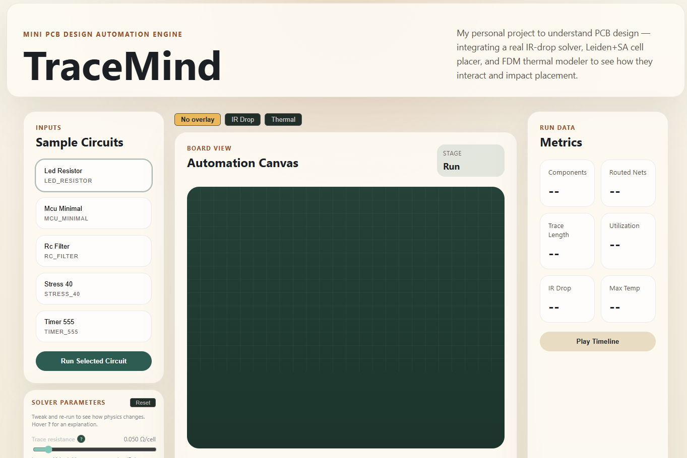
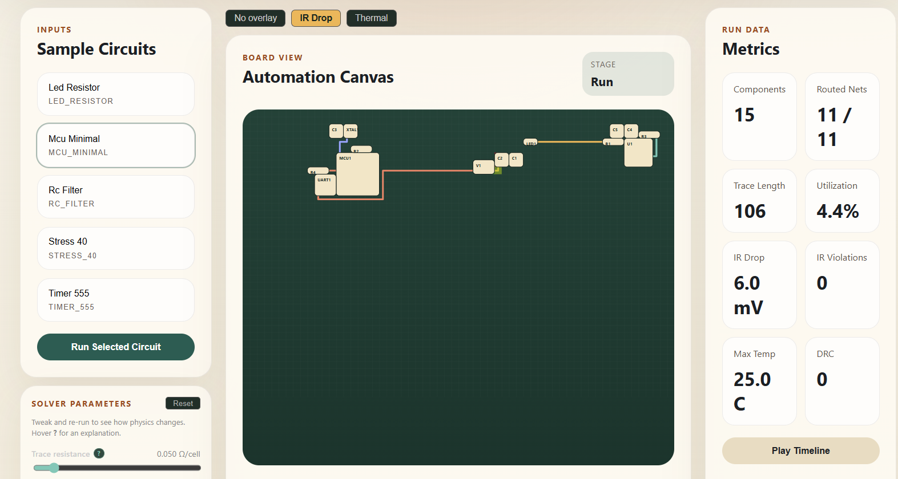
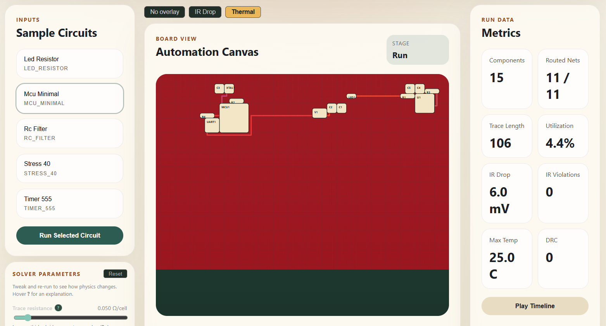
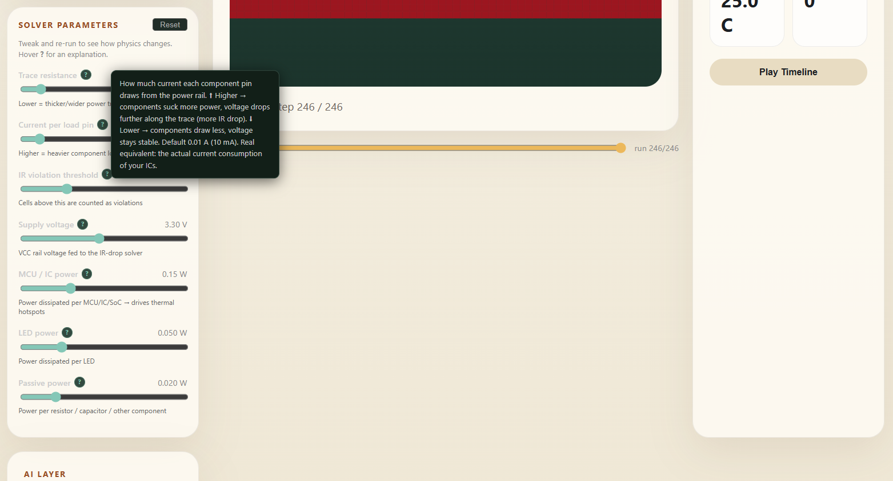
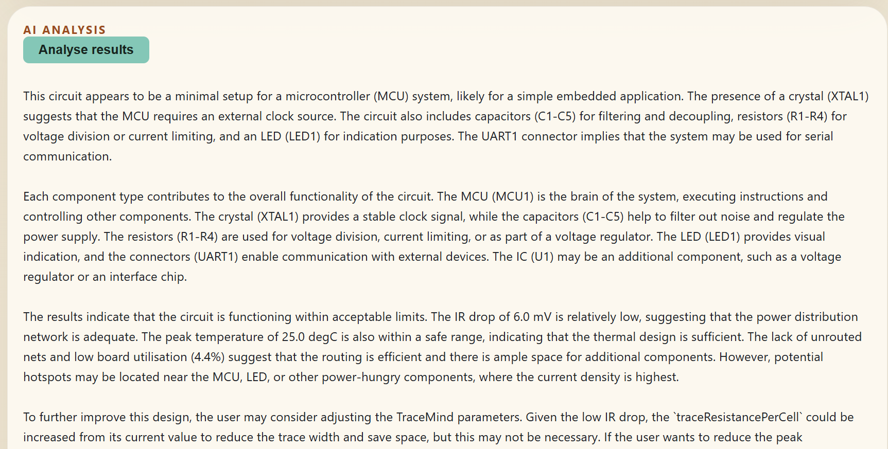

# TraceMind

> My personal project to understand PCB design — integrating a real IR-drop solver, Leiden+SA cell placer, and FDM thermal modeler to see how they interact and impact placement.

A full-stack PCB automation engine that takes a circuit netlist as JSON, automatically places components, routes traces, computes real IR-drop and thermal fields, and lets you tweak every physical parameter live in the browser to see what happens.

---

## Screenshots

### Main Dashboard


### IR Drop Heatmap Overlay


### Thermal Heatmap Overlay


### Solver Parameters Panel with Tooltips


### AI Analysis & Fix Suggestions


> **To add screenshots:** Run the app, take a screenshot of each view, and save them to `docs/screenshots/` with the filenames above.

---

## What It Does

1. Pick a sample circuit from the UI.
2. Optionally adjust solver parameters using the sliders (hover **?** for a plain-English explanation of each one).
3. Click **Run Selected Circuit** — the C++ engine runs four stages:
   - **Leiden community detection** — clusters connected components together before placement.
   - **Simulated annealing (SA) placer** — finds the best arrangement by minimising wirelength and component overlap.
   - **BFS grid router** — draws Manhattan trace paths for every net.
   - **Physical analysis** — real Eigen CG sparse solver for IR drop; 2-D Gauss-Seidel FDM for thermal.
4. The board renders instantly at the final result. Use the **timeline slider** to scrub back through every SA epoch and routing step to see how the algorithms arrived there.
5. Toggle **IR Drop** or **Thermal** overlay to see green→red heatmaps on the board.
6. Click **Analyse results** to get an AI explanation of what the circuit does and why the numbers look the way they do.

---

## UI Controls

### Circuit Selector
Pick from 5 sample circuits ranging from 3 to 40 components. Each runs the full pipeline. Switching circuit resets the board and overlays.

### Solver Parameters Panel

Each slider has a **?** icon — hover it for a plain-English tooltip explaining what the parameter controls and what raising or lowering it does physically.

| Parameter | Default | What it controls |
|---|---|---|
| **Trace resistance** | 0.05 Ω/cell | How much resistance each grid cell of a power trace has. Lower = thicker trace = less IR drop. |
| **Current per load pin** | 0.01 A | How much current each component draws from the power rail. Higher = more IR drop. |
| **IR violation threshold** | 30 mV | Max acceptable voltage drop. Cells above this are flagged red in the IR Drop overlay. |
| **Supply voltage** | 3.3 V | The VCC rail voltage. Affects how the IR-drop solver computes node voltages. |
| **MCU / IC power** | 0.15 W | Watts dissipated per microcontroller or IC. Higher = hotter hotspot on thermal overlay. |
| **LED power** | 0.05 W | Watts dissipated per LED. |
| **Passive power** | 0.02 W | Watts dissipated per resistor, capacitor, or other passive component. |

Changed parameters turn **amber**. Click **Reset** to restore all defaults.

### Board Overlays

| Button | What it shows |
|---|---|
| No overlay | Raw board: components and traces only. |
| IR Drop | Green→red heatmap of voltage drop across the power net. Red = high drop = potential problem. |
| Thermal | Green→red heatmap of temperature across the board. Red = hotspot. |

### Timeline Scrubber

After a run, a slider appears below the board. Drag it left to scrub back through the SA placement epochs and BFS routing steps. Drag right to return to the final result. The stage label and step counter update as you drag.

**Play / Pause / Replay** button animates the timeline automatically.

### AI Analysis

- **Before a run:** "Explain circuit" — asks the AI what the circuit does and which parameters to experiment with.
- **After a run:** "Analyse results" — sends the actual IR drop, temperature, and routing metrics to Groq. Returns a 4-paragraph explanation covering circuit purpose, component roles, what the numbers mean, and what to change.

**Fix suggestions** appear automatically after a run if there are IR-drop violations or unrouted nets. The AI knows your current parameter values and will tell you specifically what to change (e.g. "your traceResistancePerCell is currently 0.5 — try lowering it to 0.05").

---

## Output Metrics Explained

| Metric | What it means | Good value |
|---|---|---|
| **Components** | Total components in the circuit | — |
| **Routed Nets** | Nets successfully connected by the BFS router | Equal to total nets |
| **Trace Length** | Total number of grid cells used by all traces | Lower = more compact routing |
| **Utilization %** | Percentage of the board area covered by components | 5–30% typical |
| **IR Drop (mV)** | Maximum voltage drop anywhere on the power net | < 30 mV (threshold) |
| **IR Violations** | Number of grid cells above the violation threshold | 0 ideally |
| **Max Temp (°C)** | Hottest point on the board from the FDM solver | Depends on components |
| **DRC** | Design Rule Check failures = unrouted nets | 0 ideally |

---

## Why Built This Way

| Decision | Reason |
|---|---|
| C++ engine, not Python | SA + Leiden on a 40-component board takes 14 s in C++; Python would take minutes. |
| Eigen CG sparse solver | Direct port of the [Power-Grid-IR-Drop-Analyzer](https://github.com/Nsai-roshan/Power-Grid-IR-Drop-Analyzer) repo. Exact same math, adapted to PCB trace geometry. |
| Leiden before SA | SA gets stuck in local minima from random starts. Leiden community-grouped seeds converge faster and produce better layouts. |
| FDM Gauss-Seidel for thermal | Simplest correct steady-state heat solver; converges in < 300 iterations for these board sizes. |
| FastAPI subprocess model | C++ and Python are fully decoupled. Engine is a plain CLI binary; backend spawns it and parses stdout. Easy to rebuild engine without touching Python. |
| Vite proxy to backend | Avoids CORS issues without a reverse proxy. One `npm run dev` and the frontend talks to FastAPI. |
| Groq (not OpenAI) | Free tier, fast inference, OpenAI-compatible endpoint — no SDK needed. |

---

## Tech Stack

| Layer | Technology | Why |
|---|---|---|
| Core engine | C++ 17, CMake, Eigen 3.4, nlohmann/json | Eigen for sparse CG; nlohmann/json for zero-boilerplate JSON I/O |
| Backend | Python 3.12, FastAPI, uvicorn, httpx | Typed request/response models; httpx for sync Groq calls |
| Frontend | React 18, TypeScript, Vite | Fast HMR; TypeScript catches JSON shape bugs early |
| AI | Groq API (llama-3.3-70b-versatile) | Free tier, OpenAI-compatible, no extra SDK |
| Build | CMake FetchContent (Eigen, nlohmann/json, GoogleTest) | Single-command reproducible build, no system installs |

---

## Infrastructure & Data Flow

```
 +------------------+
 |  Browser (React) |
 |  localhost:5173  |
 +--------+---------+
          |  /api/*  (Vite proxy)
          v
 +------------------+         subprocess         +----------------------+
 | FastAPI Backend  | ----------------------->   | C++ Engine (binary)  |
 | localhost:8000   |   circuit JSON + params     |                      |
 |                  |                             |  1. Parse JSON       |
 |  POST /api/runs  | <----- stdout JSON -------- |  2. Leiden cluster   |
 |  POST /circuits  |                             |  3. SA placement     |
 |    /{id}/explain |                             |  4. BFS routing      |
 +--------+---------+                             |  5. CG IR solver     |
          |                                       |  6. FDM thermal      |
          | HTTPS                                 +----------------------+
          v
 +------------------+
 |   Groq API       |
 |  (optional)      |
 |  llama-3.3-70b   |
 +------------------+
```

**Request lifecycle:**
```
Browser
  POST /api/runs { circuitId: "mcu_minimal", params: { traceResistancePerCell: 0.02, ... } }
    -> FastAPI validates circuit id (allowlist regex + path traversal check)
    -> spawns engine binary: tracemind_engine circuit.json '{"traceResistancePerCell":0.02,...}'
    -> engine runs Leiden → SA → BFS → CG IR → FDM thermal
    -> engine writes full JSON to stdout
    -> FastAPI parses stdout, calls Groq to enhance commentary
    -> calls suggest_fixes() with current param values if violations found
    -> returns full payload to browser
Browser
  renders board at final state
  scrubber lets user replay each SA epoch and routing step
  IR Drop / Thermal buttons show heatmap overlays
  "Analyse results" -> POST /api/circuits/mcu_minimal/explain { metrics }
    -> Groq returns 4-paragraph analysis with TraceMind-specific suggestions
```

---

## Sample Circuits

| Circuit | Components | Board | Purpose |
|---|---|---|---|
| `led_resistor` | 3 (battery, resistor, LED) | 24×14 | Simplest complete circuit. Good first run to understand the flow. |
| `rc_filter` | 5 (supply, 2×R, 2×C) | 30×18 | Low-pass RC filter. VCC net gives the IR-drop solver something real to solve. |
| `timer_555` | 8 (555 timer, R×3, C×2, supply, LED) | 40×24 | Classic astable oscillator. Tests Leiden community detection — timer + passives form one natural cluster. |
| `mcu_minimal` | 15 (MCU, ICs, R×5, C×4, LED×2, connector) | 60×40 | Representative embedded design. IR drop shows realistic 6 mV on VCC rail at defaults. |
| `stress_40` | 40 (mix of R, C, U, LED) | 80×60 | Scale test. 14-second SA run. Some components are unconnected (intentional DRC stress). |

---

## Baseline Results (default parameters)

| Circuit | IR Drop | IR Violations | Peak Temp | Routed | SA Time |
|---|---|---|---|---|---|
| led_resistor | 2.5 mV | 0 | 25.0 °C | 3/3 | < 1 s |
| rc_filter | 1.5 mV | 0 | 25.0 °C | 4/4 | < 1 s |
| timer_555 | 7.0 mV | 0 | 25.0 °C | 7/7 | ~1 s |
| mcu_minimal | 6.0 mV | 0 | 25.0 °C | 11/11 | ~2 s |
| stress_40 | 231.0 mV | 105 | 25.0 °C | 13/15 | ~14 s |

**What happens when you crank the sliders:**

| Change | Effect |
|---|---|
| Trace resistance 0.05 → 0.5 | IR drop × 10 (same circuit, 10× more resistance) |
| Current per pin 0.01 → 0.1 A | IR drop × 10 (more current through the same traces) |
| Both cranked simultaneously | IR drop × 100 (e.g. 2.5 mV → 250 mV on led_resistor) |
| MCU power 0.15 → 0.5 W | Thermal hotspot becomes clearly visible on overlay |
| Violation threshold 30 → 10 mV | More cells flagged red even without changing actual physics |

---

## Input Format

```json
{
  "board": { "width": 60, "height": 40 },
  "components": [
    {
      "id": "MCU1", "kind": "mcu", "width": 6, "height": 6,
      "pins": [
        { "id": "VCC", "x": 3, "y": 0 },
        { "id": "GND", "x": 0, "y": 5 }
      ]
    }
  ],
  "nets": [
    {
      "id": "VCC",
      "connections": [
        { "component": "V1",   "pin": "POS" },
        { "component": "MCU1", "pin": "VCC" }
      ]
    }
  ]
}
```

- `kind` values that affect thermal: `mcu`, `ic`, `cpu`, `soc`, `led`, `battery`, `connector`, `resistor`, `capacitor`
- Net IDs that trigger the IR-drop solver: `VCC`, `VDD`, `3V3`, `5V`, `PWR*`, `VDD*`, `VCC*`
- Board dimensions are in unitless grid cells (not mm)

---

## How To Run

### First-time setup

```powershell
# Install Python deps
pip install fastapi uvicorn httpx

# Build the C++ engine
$cmake = "$env:APPDATA\Python\Python312\site-packages\cmake\data\bin\cmake.exe"
& $cmake -S core -B core/build -DCMAKE_BUILD_TYPE=Release
& $cmake --build core/build --config Release

# Install frontend deps
cd frontend; npm install; cd ..
```

### Every time after that

```powershell
.\start.ps1
```

Opens backend on `http://localhost:8000` and frontend on `http://localhost:5173`.

### With AI explanations

```powershell
$env:GROQ_API_KEY = "your_key_here"
.\start.ps1
```

---

## Project Structure

```
PCB x AI/
+-- core/                        C++ engine
|   +-- src/
|   |   +-- model/               Circuit parser (JSON -> structs)
|   |   +-- placer/              Leiden community detection + SA placer
|   |   +-- router/              BFS grid router
|   |   +-- irdrop/              Eigen CG sparse IR-drop solver
|   |   +-- thermal/             Gauss-Seidel FDM thermal solver
|   |   +-- engine/              Orchestrates all stages, emits run JSON
|   |   +-- main.cpp             CLI entry point (accepts params JSON as 2nd arg)
|   +-- tests/                   GoogleTest unit tests
|   +-- CMakeLists.txt
+-- backend/
|   +-- app/
|       +-- main.py              FastAPI endpoints
|       +-- services/
|           +-- circuit_loader.py   Loads + validates circuit JSON
|           +-- engine_runner.py    Spawns engine binary, passes params
|           +-- ai_narrator.py      Groq integration with TraceMind context
+-- frontend/
|   +-- src/
|       +-- App.tsx
|       +-- components/
|           +-- BoardView.tsx        SVG canvas + IR/thermal heatmap overlay
|           +-- CircuitList.tsx      Circuit picker
|           +-- MetricsPanel.tsx     Run metrics display
|           +-- CommentaryPanel.tsx  AI commentary stream
|           +-- ParametersPanel.tsx  Solver parameter sliders with tooltips
|       +-- lib/types.ts
+-- data/
|   +-- sample_circuits/         5 input netlists (JSON)
+-- docs/screenshots/            UI screenshots
+-- start.ps1                    One-command launcher (backend + frontend)
```